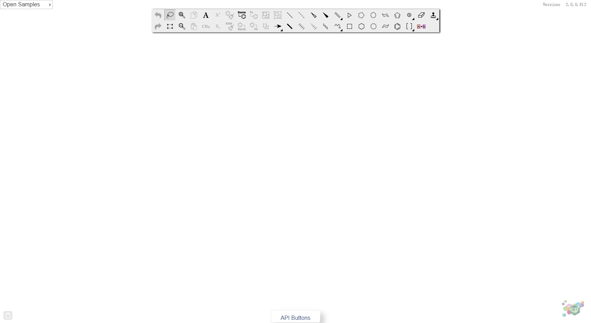

# ChemDraw Direct 2.0 User Guide

---
## 1 Introduction
ChemDraw Direct is a lightweight JavaScript-based chemical drawing tool built using modern web technologies that can be easily integrated into web-based applications such as PerkinElmer Elements via its published API.
This guide describes the procedures for loading and attaching it, as well as API usage and functionality.

## 2 Getting Started
This topics covered in this chapter will help you become familiar with the user interface:

### About ChemDraw Tutorials
There are seven tutorials available in the Tutorials chapter

 -  Tutorial 1: Drawing a Structure
 -  Tutorial 2: Using Rings
 -  Tutorial 3: Fischer Projections
 -  Tutorial 4: Perspective Drawings
 -  Tutorial 5: Newman Projections
 -  Tutorial 6: Stereochemistry
 -  Tutorial 7: Templates

 These tutorials provide step-by-step instructions to help you work with the ChemDraw tools.
 
### ChemDraw User Interface
By default, the user interface displays toolbars, Samples button, Version,ChemDraw logo and API button. The user interface appears below:

ChemDraw Direct user interface

### Toolbars
The  toolbar includes the tools most commonly used for drawing structures. These include all selection and bond tools.

#### seconday tools
Some tools on the main toolbar have  seconday tools associated with them. These are indicated by a small black triangle in the lower right corner. For example:

